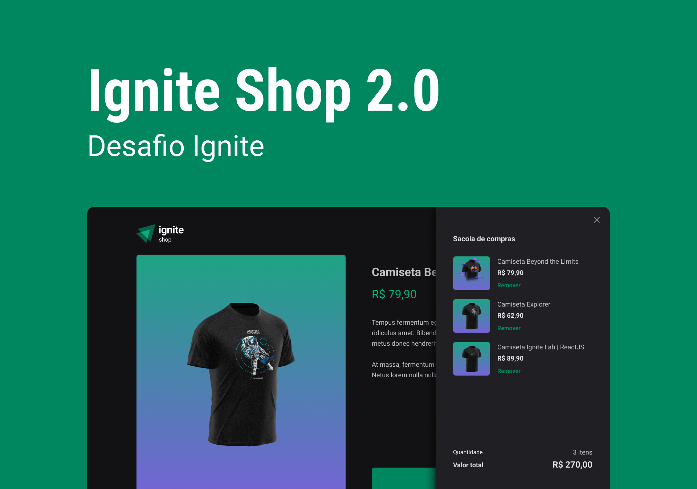

<div align='center'>
  
</div>

<h1 align='center'>
Ignite Shop
</h1>

<h4 align='center'>
Desafio 4 - Ignite 2022 🚀
</h4>

 # 💻 Projeto

Loja on-line de camisetas, onde o usuário possui uma lista de produtos podendo adicionar ao carrinho de compras um ou mais dos produtos disponíveis e finalizar com checkout utilizando o Stripe.

A aplicação foi densevolvidade com NextJS + Typescript + Stripe e como desafio do módulo 4 do bootcamp Ignite - 2022 foi implementado um carrinho de compras.

O Projeto também foi desenvolvido junto com o instrutor durante a aula, apenas seguindo o layout proposto na plataforma do Figma, seguindo arrisca todos os paramentros de cores, tamanho das fontes, espaçamento e estados em que cada elemento possa assumir na aplicação, além de, ter sido incluído alguns elementos a mais a fim de enriquecer o projeto, como responsividade.
 
 # 🧪 Tecnologias

Esse projeto foi desenvolvido com as seguintes principais tecnologias:
- [NextJS](https://nextjs.org/);
- [Typescript](https://www.typescriptlang.org/);
- [StripeAPI](https://stripe.com/docs/api)
- [KeenSlider](https://keen-slider.io/)
- [Axios](https://axios-http.com/docs/intro)
- [React Modern Drawer](https://github.com/Farzin-Firoozi/react-modern-drawer#readme)
- [React Responsive](https://github.com/yocontra/react-responsive)
- [Use Cart Shopping](https://useshoppingcart.com/)


# 🚀 Como executar

Clone o projeto e acesse a pasta do mesmo.

```bash
$ git clone https://github.com/MarcosMDev/ignite-shop
$ cd ignite-shop
```
Para iniciá-lo, siga os passos abaixo:
```bash
# Instalar as dependências
$ npm install
# Iniciar o projeto
$ npm run dev
```
O app estará disponível no seu browser pelo endereço http://localhost:3000.

# 🎨 Layout
Você pode visualizar o layout do projeto através do link abaixo:
- [Layout Web](https://www.figma.com/file/6BHyaNWRm2pT96Uo3YJjKI/Ignite-Shop-2.0-(Copy)?t=qh3ZhOKZ5vcuZXUK-6) (Lembrando que você precisa ter uma conta no Figma).

# 📃 License
[MIT](https://choosealicense.com/licenses/mit/)